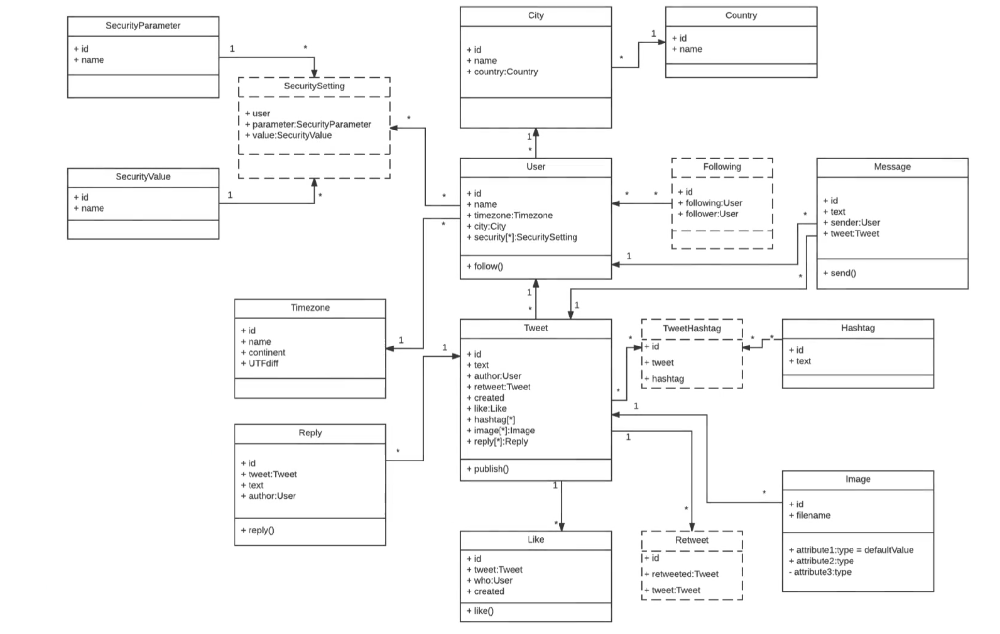

# UML (unified modeling language)

> What is UML?
- UML lets you create a visual model of how the program works, lets you dumb it down for non programmer people

> Activity Diagram:
- It is best to build out a visual representation of the app before you even start the code, to break down each step of the app

> Deployment Diagram
- takes a high level view of the program step by step to break it down

> Class Diagram
- used to have an organized view of the classes and what they do and the naming conventions used

> Use Case Diagram
- Organizes the use and interaction of each item of the app and how the user interacts with it

> Package Diagram
- a break down of each component to conform with best practices and keep people up to speed on how the system is organized